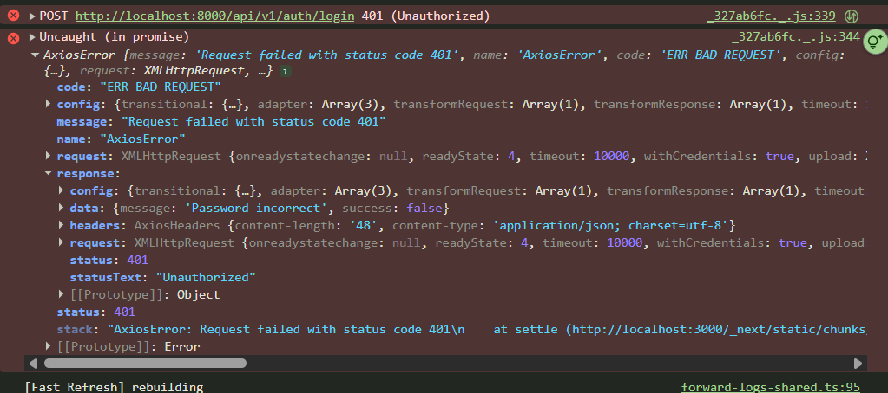
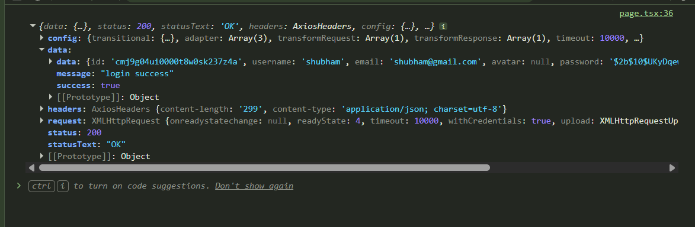

### learning from this project.

#### Middleware/proxy in Nextjs

What we think is, we will call api to check cookies and then send to frontend, frontend get response and on that basis, frontend redirect the user.
**But here things get tricky.**

1. first of all, the page in which you wriiten api call func and get res and decide user where to redirect, this page actually already loaded/download in browser. AS hacker get this page before validation in server going on.

```javascript
export default function Dashboard() {
  useEffect(() => {
    // This runs AFTER render
    checkAuth();
  }, []);

  return <div>Secret Data</div>; // ⚠️ This shows IMMEDIATELY
}
```

Why This Happens
React doesn't wait for useEffect to finish before rendering.

Contrast with Middleware (middleware.js/proxy.js) in Nextjs

```javascript
// middleware.js
export async function middleware(request) {
  console.log("1. Middleware runs");

  const isValid = await fetch("http://backend.com/api/verify");
  console.log("2. API response received");

  if (!isValid) {
    console.log("3. Redirecting");
    return NextResponse.redirect("/login");
  }

  console.log("4. Allowing page to load");
  return NextResponse.next();
}
```

**Timeline:**

```
0ms:   User requests /dashboard

10ms:  Middleware runs
       API call to backend

110ms: API responds: "Not authenticated"
       Middleware redirects to /login

120ms: User sees LOGIN page

❌ User NEVER saw dashboard
✅ Dashboard page.tsx NEVER loaded
```

<!-- Middleware runs on edge before going to any route -->

Even when you think, i will show loading state. JS file still in browser devtools.
So, use Middleware.

---

### Architecture of app in Nextjs

what I think. frontend(nextjs) --> server(nodejs) back to frontend.
meaning calling api from nextjs and decide further. but as we go ahead i face issue of env varibale naming in Nextjs.

1. NEXT_PUBLIC_API_URL='' - can use in client component and server component.
2. API_URL='' - this can only accessible in server components

prefix with NEXT_PUBLIC, allow client to access env and get build and bundle in JS during build. on the otherhand, API_URL stay away from client with server making this env secure.
Now its totally depend on env value.

- If there is any secret key or secret to store. **you must use without prifix. ie `SECRER_KEY='xyz'`**

- If there no secure value such as backend domain url, so you can use prifix. **ie . NEXT_PUBLIC_API_URL.** as backend domain anyway get access by client by browser. and also acess

OKAY. after knowing this, what should we do. i mean connect frontend and backend

Read this - [chat from claude](https://claude.ai/share/1dd0e7b6-8ac9-4e3e-b28e-0ff0b7096eb8)

1. first approach. store backend domain as prefix with NEXT_PUBLIC and fetch from events directly. but still if needed secret to access (as you store in .env.local with no prefix), you have call in server component (Client → Next.js API Route → Backend). like /app/api/openAi/route.ts.

below code of app/page.tsx for

```javascript
export default function Home() {
  const handleClick = async () => {
    const response = await api.get("/");
    console.log(response.data);
    redirect("/login");
  };
  return (
    <>
      <Button
        onClick={handleClick}
        variant={"secondary"}
        className="mt-3.5 text-xl cursor-pointer"
      >
        Lets Chat
      </Button>
    </>
  );
}
```

below code for calling api with secrets

```javascript
// app/api/openai/route.ts
export async function POST(req) {
  const body = await req.json();

  // Secret stays server-side
  const response = await fetch("https://api.openai.com/v1/chat", {
    headers: {
      Authorization: `Bearer ${process.env.OPENAI_API_KEY}`, // 🔒 Safe
    },
    body: JSON.stringify(body),
  });

  return response;
}
```

2. Pattern B: BFF/Proxy Pattern (Good for monolithic teams)

```javascript
// Client calls Next.js
await fetch('/api/login', { ... });

// Next.js proxies to backend
export async function POST(req) {
  const response = await fetch(`${process.env.BACKEND_URL}/login`, ...);
  // Transform, log, set cookies, etc.
  return response;
}
```

---

#### Again here a update guide from claude. Go below link and read last chat session

(LAST ONE)

[Problem with "NEXT_PUBLIC" prefix](https://claude.ai/share/1dd0e7b6-8ac9-4e3e-b28e-0ff0b7096eb8)

The **"elite mental model"** should be: Use the simplest architecture that meets your requirements.

I still need understand deeply && for this simple project i am using NEXT_PUBLIC appoach as i dont have any secrets here in Nextjs.

---

### Client-server architecture on how to navigate from server and what should we follow.

#### Please read second 2nd chat, not first. in this, i am using correct right approach

[chat from claude](https://claude.ai/share/8d378f3e-c8b5-40c2-bfaa-135dd2d2714f)

Real-World Best Practice 🏆

```javascript
// Backend - Return structured data
app.post("/auth/signup", async (req, res) => {
  try {
    const user = await createUser(req.body);
    res.status(201).json({
      success: true,
      data: { user },
      redirect: "/dashboard", // Optional: suggest where to go
    });
  } catch (error) {
    res.status(400).json({
      success: false,
      error: error.message,
    });
  }
});

// Frontend - Smart navigation
try {
  const { data } = await api.post("/auth/signup", formData);

  // Optional: Use backend suggestion
  router.push(data.redirect || "/login");

  // Or: Your own logic
  if (data.user.needsVerification) {
    router.push("/verify-email");
  } else {
    router.push("/dashboard");
  }
} catch (error) {
  // Handle error
}
```

---

### Concept of Axios error and Error resulting from TS

**Axios Error response**


**Success response in frontend to access required data and messages**


**Error object**
error.message - [nodejs Error docs](https://nodejs.org/api/errors.html#errormessage)

---

### Multiple api calls in nested components.

[Read this claude chat](https://claude.ai/share/71a50730-cdb9-4fe0-a6c4-29250d4af1cb)

---

### cn() in tailwindcss

**Allow to write conditional tailwindcss classes**
_refer from chat-sidebar.tsx_

```javascript
<button
  key={chat.id}
  onClick={() => setSelectedChat(chat)}
  className={cn(
    "flex w-full items-center gap-3 rounded-lg px-3 py-3 text-left transition-colors hover:bg-background cursor-pointer",
    selectedChat !== null && selectedChat.id === chat.id ? "bg-background" : ""
  )}
></button>
```

---

### Sorting/filtering chats using keywords

Of course! Let me explain this step by step. It's actually a really interesting JavaScript behavior! 🎯

#### How `.includes("")` Works

The key is understanding what the `.includes()` method does with an **empty string**.

#### The Rule:

**Every string contains an empty string!**

Think of it like this: an empty string `""` exists at every position in every string, including at the very beginning.

#### Examples:

```javascript
// Any string includes an empty string
"Hello".includes(""); // ✅ true
"World".includes(""); // ✅ true
"".includes(""); // ✅ true (even empty includes empty!)
"JavaScript".includes(""); // ✅ true

// But with actual characters:
"Hello".includes("Hel"); // ✅ true (found)
"Hello".includes("xyz"); // ❌ false (not found)
```

#### In Your Code:

Let's trace through what happens:

**Scenario 1: Search is empty**

```javascript
const searchQuery = ""; // User hasn't typed anything

conversations.filter((conv) => conv.name.toLowerCase().includes(""));

// For each conversation:
// "John Doe".toLowerCase().includes("")     → true ✅
// "Jane Smith".toLowerCase().includes("")   → true ✅
// "Bob Wilson".toLowerCase().includes("")   → true ✅

// Result: ALL conversations pass the filter!
```

**Scenario 2: Search has text**

```javascript
const searchQuery = "John"; // User typed "John"

conversations.filter((conv) => conv.name.toLowerCase().includes("john"));

// For each conversation:
// "john doe".includes("john")     → true ✅
// "jane smith".includes("john")   → false ❌
// "bob wilson".includes("john")   → false ❌

// Result: Only "John Doe" passes the filter!
```

#### Visual Representation:

```
String: "Hello"
Empty string "" can be found at positions:
|H|e|l|l|o|
↑ ↑ ↑ ↑ ↑ ↑
"" exists at ALL these positions!

That's why "Hello".includes("") is always true!
```

#### Why This Is Useful:

This behavior makes your filter code **elegant and simple**:

- ✅ No need for `if (searchQuery === "") return conversations;`
- ✅ No need for special cases
- ✅ One filter handles both empty and filled search states
